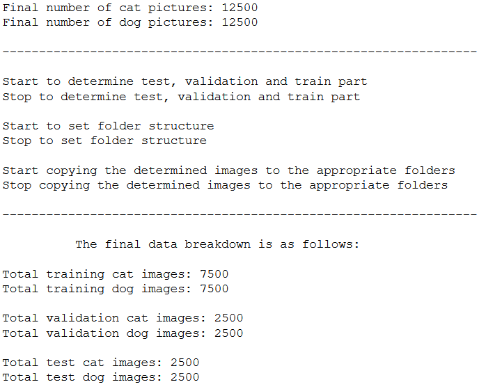
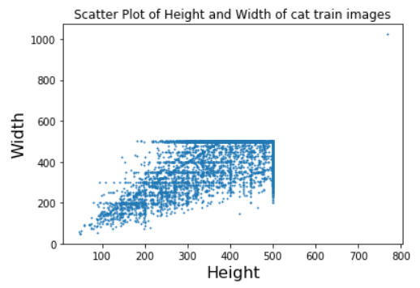
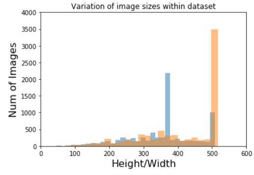
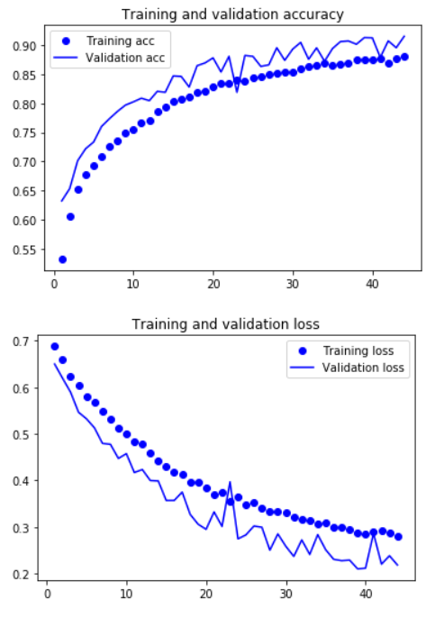

# Computer Vision: CNN for binary Classification


<p align="center">
  
</p>

Source: [DataFlair](https://data-flair.training/)

The goal of this project is to use a convolutional neural network (CNN) to determine cat and dog images. 
How I proceeded exactly and what results I achieved can be read in my blog post: [Computer Vision - Convolutional Neural Network](https://michael-fuchs-python.netlify.app/2021/01/08/computer-vision-convolutional-neural-network/)


## Table of Contents
1. [Introduction](#introduction)
2. [Software Requirements](#software_requirements)
3. [Getting Started](#getting_started)
4. [Folder Structure](#folder_structure)
5. [Running the Jupyter Notebook](#running_jpynb)
    1. [Execution of the preprocessing_CNN.py file](#running_preprocessing)
    2. [Classify Cat Dog Images](#classify_cat_dog_images)
6. [Project Results](#project_results)    
7. [Authors](#authors)
8. [Project Motivation](#motivation)
9. [Acknowledgements](#acknowledgement)


<a name="introduction"></a>

## Introduction

For this repository I wrote a preprocessing.py file which automatically randomizes the provided image data and divides it into a training, validation and test part. 
This is followed by model training using a CNN. 
The storage of the best model as well as the safeguarding of all important metrics during the model training is also fully automatic. 
This is a best practice guideline on how to create a binary image classifier and bring it to production. 


<a name="software_requirements"></a>

## Software Requirements

Required libraries:

+ Python 3.x
+ Scikit-Learn
+ Keras
+ TensorFlow
+ Numpy
+ Pandas
+ Matplotlib
+ OpenCV

Please run ```pip install -r requirements.txt```


<a name="getting_started"></a>

## Getting Started

1. Make sure Python 3 is installed.
2. Clone the repository and navigate to the project's root directory in the terminal
3. Download the [cats dataset](https://github.com/MFuchs1989/Datasets-and-Miscellaneous/tree/main/datasets/Computer%20Vision/Convolutional%20Neural%20Network/cats). Unzip the folder and place the images in the cloned repository in the folder ```cats```. If the folder does not exist yet, please create one. 
4. Download the [dogs dataset](https://github.com/MFuchs1989/Datasets-and-Miscellaneous/tree/main/datasets/Computer%20Vision/Convolutional%20Neural%20Network/dogs). Unzip the folder and place the images in the cloned repository in the folder ```dogs```. If the folder does not exist yet, please create one. 
5. Start the notebook ```Computer Vision - CNN for binary Classification.ipynb```.


<a name="folder_structure"></a>

## Folder Structure

The current folder structure should look like this:

```
C:.
│   Computer Vision - CNN.ipynb
│   preprocessing_CNN.py
│
├───cats
├───dogs
└───test_pictures
```


<a name="running_jpynb"></a>

## Running the Jupyter Notebook


<a name="running_preprocessing"></a>

### Execution of the preprocessing_CNN.py file

Import all necessary libraries and execute the train-validation-test-split function.

Here is the output of the function:




<a name="classify_cat_dog_images"></a>

### Classify Cat Dog Images

Execute all remaining lines of code in the notebook.

**Descriptive statistics**






**Model Evaluation**




<a name="project_results"></a>

## Project Results

In summary, the CNN model I created with transfer learning far surpassed the CNN created from scratch in terms of performance. 
The accuracy of the InceptionV3-model (pre-trained on ImageNet) reached 79.55% while the CNN from scratch was about 5%.
The ImageNet dataset contains more than one million training images on which the InceptionV3 model was trained. This results in an extreme increase in performance compared to CNN from scratch. 
The accuracy of 5% could possibly have been increased again if data augmentation had been used in the model training.
When tested on new images, the CNN model with transfer learning performed as I expected, not perfect but good enough. 

<a name="authors"></a>

## Authors

+ [Michael Fuchs](https://github.com/MFuchs1989)

<a name="motivation"></a>

## Project Motivation: 

Udacity has given students the freedom to choose the area in which they would like to complete their capstone project. Possible technical fields would have been:

+ [Robot Motion Planning](https://docs.google.com/document/d/1ZFCH6jS3A5At7_v5IUM5OpAXJYiutFuSIjTzV_E-vdE/pub)
+ [Healthcare](https://docs.google.com/document/d/1WzurKKa9AX2DnOH7KiB38mvozdOSemfkGpex8hdTy8c/pub)
+ [Computer Vision](https://docs.google.com/document/d/1y-XfjkPFgUQxFIQ9bBncUSjs4HOf5E-45FrLYNBsZb4/pub)
+ [Education](https://docs.google.com/document/d/1vjerjRQnWs1kLbZagDYT6rNqiwAG23Yj45oUY88IAxI/pub)
+ [Investment and Trading](https://docs.google.com/document/d/1ycGeb1QYKATG6jvz74SAMqxrlek9Ed4RYrzWNhWS-0Q/pub)

As I am personally very interested in Deep Learning and have already completed my Nanodegree in Computer Vision via Udacity, I found it exciting to complete my capstone project in this area as well. 
So I choose to use Convolutional Neural Networks to Identify Dog Breeds.

<a name="acknowledgement"></a>

## Acknowledgements

I thank [Udacity](https://www.udacity.com/) for providing this challenge and learning experience. 
